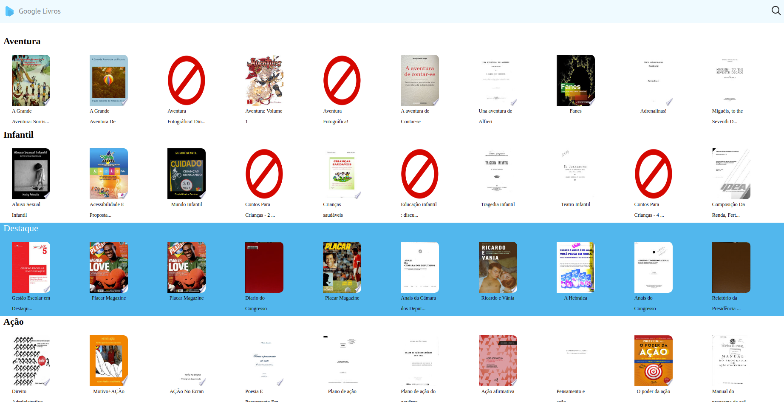
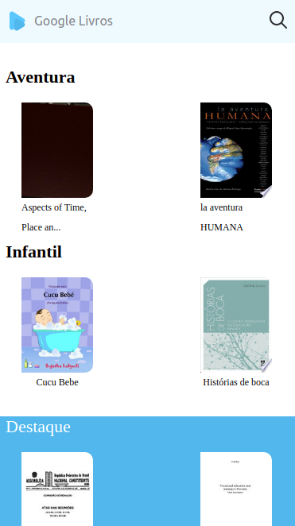
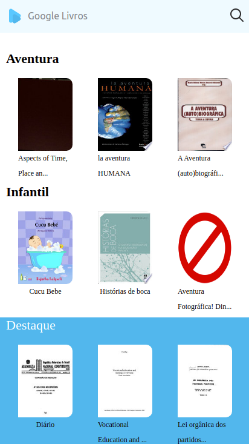
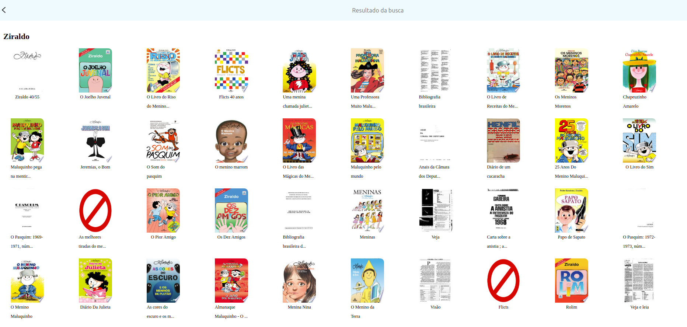

# Virtual BookShelf

The project uses a public GoogleAPI (see API Reference) to get books and displays
them on a react layout.  
The main page has a search button and by default displays four book categories.  
When a book thumbnail is clicked, it leads you to google book preview.

## Screenshots
#### Desktop:

#### iPhone 6/7/8:

#### iPhone 6/7/8+

#### Search page on desktop:

#### Search page on iPhone 6/7/8+:

## Demo

Demo link:

  
## Tech Stack

**Client:** 
* [ReactJs](https://reactjs.org/)
* [material-ui/core](http://material-ui.com/)
* [axios](https://github.com/axios/axios)
* [styled-components](https://www.styled-components.com/)

## API Reference

```http
  RawURL: https://www.googleapis.com/books/
```

#### Get all items

```http
  GET /v1/volumes?q=Query&startIndex=0&maxResults=10
```

| Parameter    | Type     | Description                                     |
| :----------- | :------- | :---------------------------------------------- |
| `q`          | `string` | Search input.                                   |
| `maxResults` | `string` | Number of max results. The highest value is 40. |
| `startIndex` | `string` | The index of the first item.                    |


  
## Roadmap

- Add a 404 not found screen

- Use history to redirect to 404 screen

- Create a logIn/signUp screen

- Add a Loading Component

- Create a custom API to store favorite/read books

- Add tests
  
## Run Locally

Clone the project virtual-bookshelf

```bash
  git clone https://github.com/andreLDias/virtual-bookshelf
```

Go to the project directory

```bash
  cd virtual-bookshelf
```

Install dependencies

```bash
  yarn
```

Start the front (when done loading, the default web browser will promp it)

```bash
  yarn start
```

  
## Authors

- [@andreLDias](https://www.github.com/andreLDias)

  